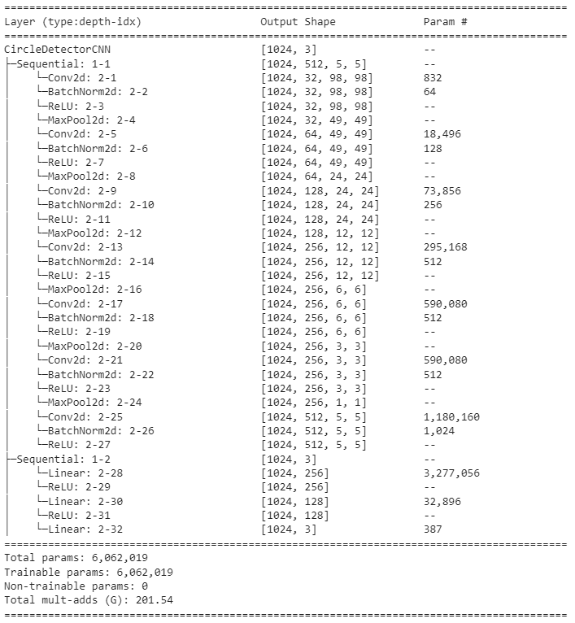
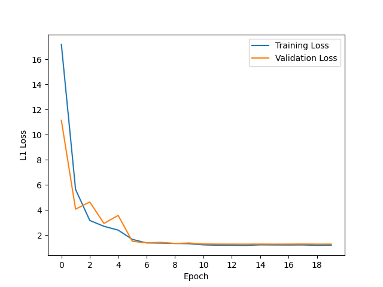
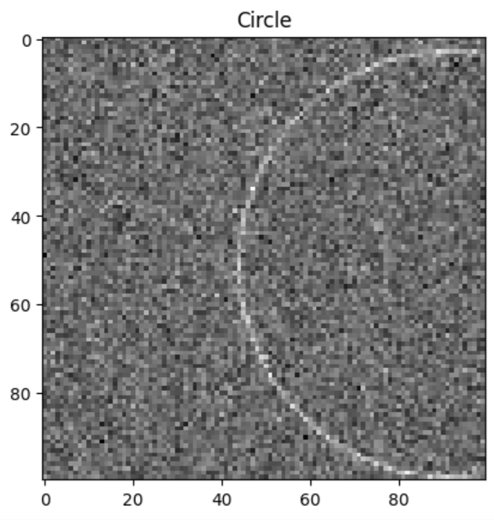
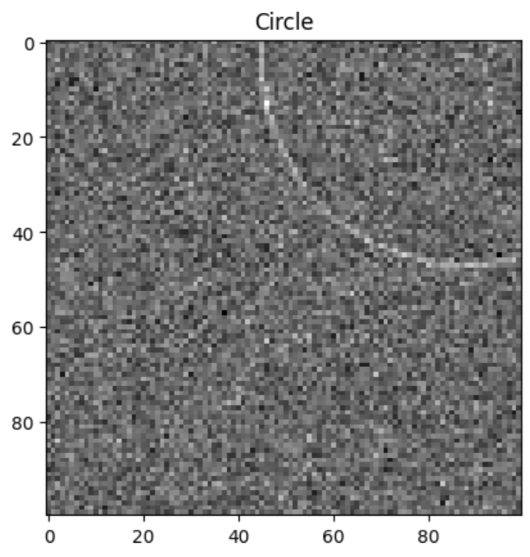
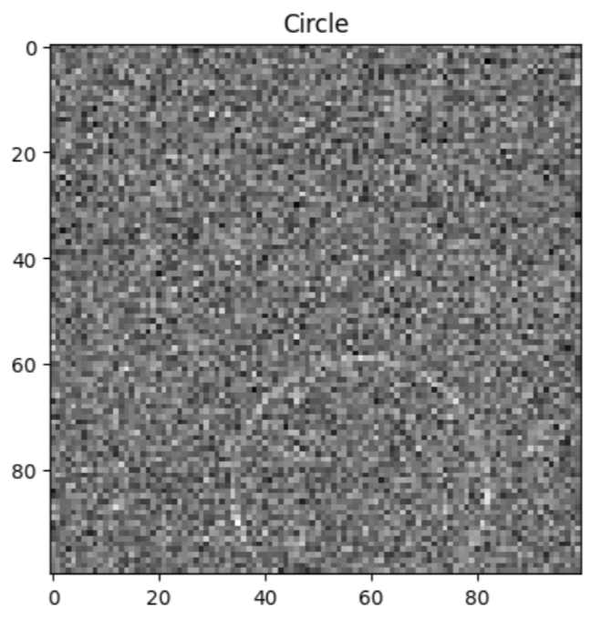

# Circle Detection in Noisy Images Using Deep Learning

## Overview

This README details the steps taken in building the dataset and training multiple CNNs on the circle detection task. I experimented with different architectures, noise levels as well as loss functions, all of which are detailed as follows.

## Steps

### 1. Dataset Generation and Preprocessing
- **Deterministic Seed**: Set a seed of 42 to enable reproducibility.
- **Dataset Creation**: Utilized the provided `generate_examples` function to create a dataset of noisy images with circles. Experimented with different noise levels of 0.3, 0.4, and 0.5 as documented below.
- **Data Splitting**: Used 50000 samples for training, 5000 for validation, and 5000 for testing. Training set was used for training the model (the model did not see the validation nor testing set at any point during training), the validation set was used to monitor model performance during training to determine if early stopping should be implemented if the validation loss stopped decreasing for consecutive epochs, and the test set was used to calculate the IOU scores.

### 2. Model Architecture

- **Design**: Implemented a custom Convolutional Neural Network (CNN) `CircleDetectorCNN` in PyTorch.
- **Configuration**: The model consists of sequential convolutional layers, pooling layers, batch normalization layers, and fully connected layers. I experimented with 4, 5, 6, and 7 convolutional layers to determine the best architecture.

### 3. Training and Optimization

- **Loss Function**: Used L1 loss as the loss function, suitable for the regression nature of the task. Tested with MSE initially, but because MSE is more sensitive to outliers as it squares the errors, larger errors have disproportionately larger impacts on MSE. This led to much lower IOU scores on the test set.
- **Optimizer**: Applied Adam optimizer for efficient training.
- **Learning Rate Scheduler**: Incorporated `StepLR` scheduler with a step size of 5 and gamma of 0.05 to adjust the learning rate at regular intervals, enhancing convergence.
- **Early Stopping**: Implemented early stopping to prevent overfitting, improving model generalization.

### 4. Evaluation Metrics

- **Intersection Over Union (IOU)**: Used IOU as the primary evaluation metric to measure the accuracy of circle detection.
- **Threshold Analysis**: Calculated the percentage of test examples where IOU exceeded thresholds like 0.5, 0.75, 0.9 and 0.95.

### 5. Results and Observations

- **Training Performance**: The model showed progressive improvement in training and validation loss, indicating effective learning.
- **Early Stopping**: Early stopping with a patience of 4 was triggered in several training instances, preventing overfitting.
- **Number of Conv Layers**: As the number of conv layers increased from 4 to 7, validation loss decreased and IOU increased. However, there were decreasing marginal improvements, and I decided to stop the training at 7 convolutional layers.
- **Noise**: As expected, lower noise levels resulted in better performance, while higher noise levels resulted in worse performance. 
- **Loss**: L1 alone performed better than L2 alone and when combined together with L2 (0.9 of L1 + 0.1 of L2). This is probably due to L2 being more sensitive to outliers as compared to L1 as mentioned above.

#### Varying Number of Convolutional Layers
**Noise = 0.5** and **Loss = L1** for all 4 experiments

| Exp.  | # Conv Layers | Average IOU  | 0.5 IOU  | 0.75 IOU  | 0.9 IOU |  0.95 IOU |
| ------------ | --------- | ------------ | ------------ | ------------ | ------------ | ------------ |
| 1  | 4  | 0.7716  | 0.9208  | 0.6774  | 0.2072 | 0.0480  |
| 2  | 5  | 0.8117  | 0.9558  | 0.7882  | 0.2814 | 0.0602  |
| 3  | 6  | 0.8659 | 0.9762  | 0.8832  | 0.5304 | 0.1836  |
| **4**  | **7**  | **0.8850**  | **0.9840**  | **0.9108**  | **0.6160** | **0.2500**  |

##### Plot of Experiment 4

#### Varying Noise
**Number of Convolutional Layers = 7** and **Loss = L1** for all 3 experiments

| Exp.  | Noise | Average IOU  | 0.5 IOU  | 0.75 IOU  | 0.9 IOU |  0.95 IOU |
| ------------ | --------- | ------------ | ------------ | ------------ | ------------ | ------------ |
| 1  | 0.5  | 0.8850  | 0.9840  | 0.9108  | 0.6160 | 0.2500  |
| 2  | 0.4  | 0.9047  | 0.9926  | 0.9424  | 0.7036 | 0.3204  |
| **3**  | **0.3**  | **0.9176** | **0.9930**  | **0.9600**  | **0.7606** | **0.4002**  |

##### Visual Comparison of Noise
| Noise = 0.3             |  Noise = 0.4 | Noise = 0.5 |
|-------------------------|-------------------------|-------------------------|
|  |   |  |

#### Varying Loss
**Number of Convolutional Layers = 7** and **Noise = 0.5** for all 3 experiments

| Exp.  | Loss | Average IOU  | 0.5 IOU  | 0.75 IOU  | 0.9 IOU |  0.95 IOU |
| ------------ | --------- | ------------ | ------------ | ------------ | ------------ | ------------ |
| **1**  | **L1**  | **0.8850**  | **0.9840**  | **0.9108**  | **0.6160** | **0.2500**  |
| 2  | L2  | 0.8636  | 0.9812  | 0.8826  | 0.4900 | 0.1512  |
| 3  | 0.9 x L1 + 0.1 x L2  | 0.8767  | 0.9838  | 0.8978  | 0.5688 | 0.2022  |

#### Fixed Parameters
- seed = 42
- img_size = 100, min_radius = 10, max_radius = 50
- kernel size of 5 for the first conv layer, 3 for the rest

### 6. Conclusion

The developed model successfully detects circles in noisy images with a high degree of accuracy. Future work may explore the impact of more complex architectures and further hyperparameter tuning for even greater accuracy.

The notebook and weights for the model trained with 7 conv layers, noise of 0.5 and L1 loss is attached.

---
